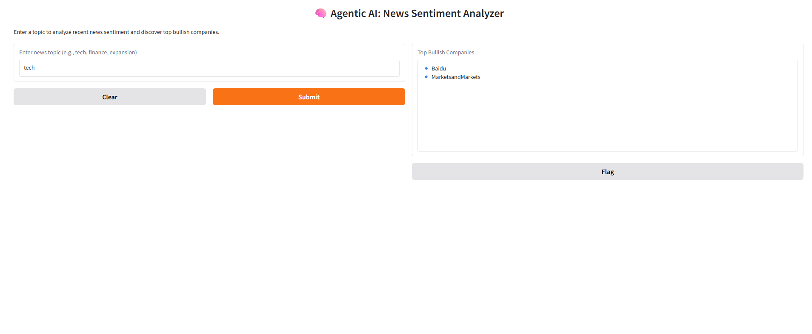

# 🧠 Agentic-AI Financial News Sentiment Analyzer

A modular Agentic AI system that fetches real-time financial news, performs sentiment analysis using FinBERT, extracts company names using NLP, and displays top bullish companies in an elegant Gradio interface.

---


## 🚀 What It Does

This project intelligently automates the process of analyzing financial news by chaining together multiple reasoning steps:

1. 📡 **Fetches news articles** from [NewsAPI](https://newsapi.org/)
2. 🧠 **Performs sentiment analysis** using `ProsusAI/FinBERT` via HuggingFace Transformers
3. 🏷️ **Extracts company names** from headlines using spaCy's Named Entity Recognition (NER)
4. 📊 **Aggregates and displays top bullish companies** based on positive sentiment scores
5. 💬 **Offers a Gradio-based UI** for seamless, interactive exploration

---
## 🖼️ Interface Preview



## 🛠️ Technologies Used

- **Python** – Core language
- **Transformers (FinBERT)** – Sentiment analysis model
- **spaCy** – Named entity recognition for company extraction
- **LangGraph** – Agent flow and state management
- **Gradio** – Web-based user interface
- **NewsAPI** – News source integration

---

## 📦 Installation

1. Clone this repository:
```bash
git clone https://github.com/your-username/Agentic-AI-Financial-News-Sentiment-Analyzer.git
cd Agentic-AI-Financial-News-Sentiment-Analyzer
```

2. Install dependencies:
```bash
pip install -r requirements.txt
```

3. Download spaCy English model:
```bash
python -m spacy download en_core_web_sm
```

---

## 🔑 Setup NewsAPI

This app uses NewsAPI to fetch recent news.

- Get your API key at [https://newsapi.org/](https://newsapi.org/)
- Replace the placeholder `API_KEY` in `first_agentic_ai.py` with your key

> ✅ Tip: For security, consider loading it from an `.env` file in production.

---

## 💻 How to Run

### 🧪 Run the Agent in Terminal (CLI)
```bash
python first_agentic_ai.py
```

- Default topic: `"expansion"`
- Output: Top bullish companies printed in the terminal

### 🖼️ Launch the Gradio UI (Recommended)
```bash
python gradio_ui.py
```

- Interactive UI at `http://127.0.0.1:7860`
- Input any topic (e.g., "AI", "biotech", "interest rates")
- Output: List of top bullish companies

---

## 📌 Example Output

```text
✅ Top Bullish Companies:
➡️ Tesla
➡️ Microsoft
➡️ JPMorgan
➡️ Nvidia
```

---

## 🧠 How It Works (Agent Flow)

```
news_scraper
   ↓
sentiment_analyzer
   ↓
company_extractor
   ↓
aggregator
   ↓
responder (Gradio/CLI)
```

Each function in the chain modifies a shared `AgentState` to progress the reasoning flow.

---

## 📋 To-Do

- [ ] Add `.env` support for API key
- [ ] Add company logo & stock ticker lookup
- [ ] Add historical sentiment trend chart
- [ ] Dockerize for deployment

---

